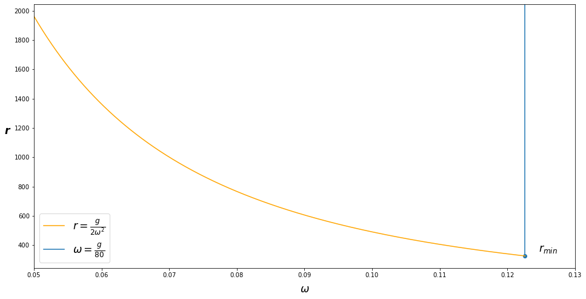

# Problem 1

## Solution

$$
\vec{r}=r\hat{e}_r=(0.9-0.12t^2)\hat{e}_r
$$

$$
\vec{v}=\dot{r}\hat{e}_r+r\dot{\theta}\hat{e}_\theta
$$

$$
\left\{
\begin{align}
\dot{r}&=-0.24t\\
\dot{\theta}&=0.3t
\end{align}
\right.
$$

therefore velocity is:
$$
\vec{v}=-0.24t\hat{e}_r+(0.9-0.12t^2)(0.3t)\hat{e}_\theta
$$
at $\theta=30^o=0.15t^2$,$t=\sqrt{\frac{\theta}{0.15} }=1.87s$
$$
\vec{v}=0.45\hat{e}_r+0.27\hat{e}_\theta
$$
for acceleration:
$$
\vec{a}=(\ddot{r}-r\omega^2)\hat{e}_r+(r\alpha+2\dot{r}\omega)\hat{e}_\theta
$$
where:
$$
\left\{
\begin{align}
r&=0.9-0.12t^2\\
\dot{r}&=-0.24t\\
\omega&=\dot{\theta}=0.3t
\end{align}
\right.
$$
and $\ddot{r}=-0.24,\alpha=0.3$. 
$$
\vec{a}=-0.391\hat{e}_r-0.358\hat{e}_\theta
$$

# Problem 2

## Solution

The acceleration of radial-transverse coordinates:
$$
\begin{align}
\vec{a}&=(\ddot{r}-r\omega^2)\hat{e}_r+(r\alpha+2\dot{r}\omega)\hat{e}_\theta
\end{align}
$$
where: $\alpha = \empty, \ddot{r}=\empty$

therefore:
$$
\vec{a}=-r\omega^2\hat{e}_r++2\dot{r}\omega\hat{e}_\theta
$$
The first term stands for simulated gravity term: $g_s$
$$
g_s=-(-r\omega^2)\geq g/2
$$
The second term stands for lateral acceleration $a_L$:
$$
a_L=2\dot{r}\omega\leq g/20
$$
given the conditions $\dot{r}=2m/s$, we have:
$$
\left\{
\begin{align}
r\omega^2 \geq g/2\\
\omega \leq g/80\\
\end{align}
\right.
$$
where the smallest radius is at:
$$
r_{min}=\frac{g}{2\omega^2}=\frac{3200}{g}=326m/1070feet
$$

